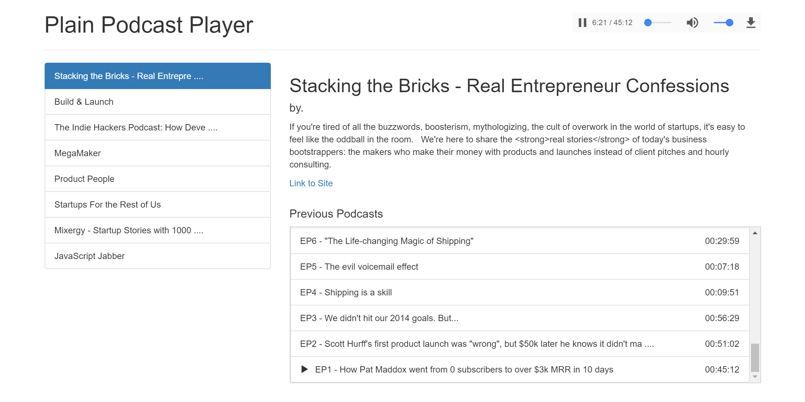

# Plain Podcast Player

> Vue based simple podcast player

## Screen-shot



## Adding your Favorite podcasts

1. Open the `static/feeds.json` file
2. Add your podcast's rss feed into this list
3. Fire-up the server and start listening

## Build Setup

``` bash
# install dependencies
npm install

# serve with hot reload at localhost:8080
npm run dev

# build for production with minification
npm run build

# build for production and view the bundle analyzer report
npm run build --report
```